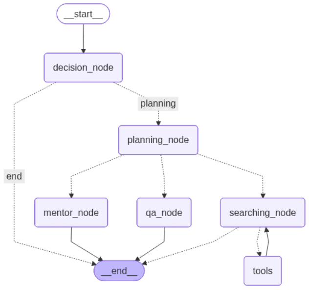

# 🤖 AI Student Assistant Agent with MCP

This project is an AI assistant for students, built using LangGraph. Its main purpose is to help with various learning tasks, including:

*   **🔬 Research**: Performs research on topics using web search and Wikipedia.
*   **❓ Q&A Generation**: Creates practice questions for any given subject.
*   **🧑‍🏫 Mentorship**: Provides educational advice and study plans.

## 🛠️ Technology Stack

The agent is built with the following technologies:

*   **Core Framework**: LangGraph & LangChain, Pydantic
*   **LLM**: Google Gemini 1.5 Flash
*   **Information Retrieval**:
    *   DuckDuckGo Search
    *   Wikipedia
*   **External Tool Integration**:
    *   `MultiServerMCPClient` (MCP) is used to integrate external, standalone tools. In this project, it provides the `time_tool` to the research agent.

## ⚙️ Architecture & Flow

The agent operates as a state machine (a "graph") where each step is a node that processes information.

1.  **Decision Node**: First, the agent assesses the user's request. Simple conversational queries get a direct answer. Complex requests are passed to the planning stage.
2.  **Planning Node**: The agent categorizes the request as "Research," "Q&A," or "Mentorship."
3.  **Execution Nodes**: Based on the plan, the request is routed to one of the specialized agents:
    *   `searching_node`: Handles research tasks.
    *   `qa_node`: Generates questions and answers.
    *   `mentor_node`: Acts as an educational advisor.
4.  **Tool Usage**: The `searching_node` can use tools like DuckDuckGo, Wikipedia, and the MCP-provided `time_tool` to fulfill requests.

## 🖼️ Workflow Diagram




## 🚀 Getting Started

### Installation

1.  **Clone this repository** to your local machine.

2.  **Install dependencies**. It is recommended to first create a Python virtual environment. Then, install all required packages using the `requirements.txt` file:
    ```bash
    pip install -r requirements.txt
    ```

3.  **Create Environment File**. Create a `.env` file in the project root, in the following format:
    ```
    GOOGLE_API_KEY="YOUR_API_KEY_HERE"
    LANGSMITH_API_KEY="YOUR_API_KEY_HERE"
    LANGCHAIN_TRACING_V2=true
    ```

### Running the Agent

This graph can be served as an API using LangGraph's built-in server.

Run the following command in your terminal:

```bash
langgraph dev --allow-blocking
```

This starts a local server, allowing you to send requests to the agent.
